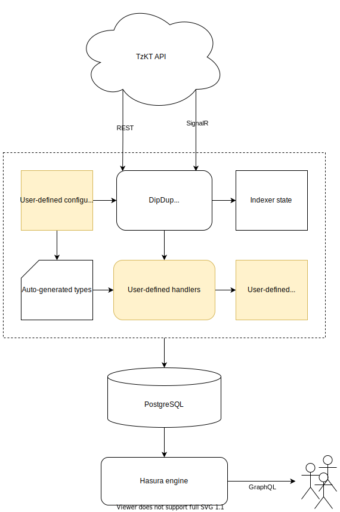

# Core concepts

Before proceeding to development, let's take a look at basic DipDup concepts.

<!-- TODO: Very complex and boring -->

## Big picture

DipDup is an SDK for building custom backends for decentralized applications, or for short, indexers. DipDup indexers are off-chain services that aggregate blockchain data from various sources and store it in a database.

Each indexer consists of a YAML configuration file and a Python package with models, handlers, and other code. The configuration file describes the inventory of the indexer, i.e., what contracts to index and what data to extract from them. It's written in YAML, supports templates, environment variables, and use syntax similar to Subgraph manifest files. The Python package contains models and handlers. Models describe the domain-specific data structures you want to store in the database. Finally, handlers implement the business logic, i.e., how to convert blockchain data to your models.

As a result, you get a service responsible for filling the database with the indexed data. Then you can use it to build a custom API backend or integrate with existing ones. DipDup provides Hasura GraphQL Engine integration to expose indexed data via REST and GraphQL with minimal configuration, but it's not a requirement. You can use other API engine like PostgREST or write one in-house.

<!-- TODO: SVG include doesn't work -->

## Storage layer

DipDup uses PostgreSQL or SQLite as a database backend. All the data is stored in a single database schema created on the first run. Make sure it's used by DipDup exclusively, since changes in index configuration or models require DipDup to drop the whole database schema and start indexing from scratch. You can, however, mark specific tables as immune to preserve them from being dropped.

DipDup does not support database schema migration. If there's any model change, it will trigger reindexing. The rationale is that it's easier and faster to start over than handle migrations that can be of arbitrary complexity and do not guarantee data consistency. DipDup stores a hash of the SQL version of the DB schema and checks for changes each time you run indexing.

DipDup applies all updates atomically block by block, ensuring data integrity. If indexing is interrupted, it can safely recover later and continue from the level it ended. DipDup state is stored in the database per index and can be used by API consumers to determine the current indexer head.

Index is a set of contracts and rules for processing them as a single entity. Your config can contain more than one index, but they are processed in parallel and cannot share data as execution order is not guaranteed.

## Handling chain reorgs

Reorg messages signal chain reorganizations, which means some blocks, including all operations, are rolled back in favor of another with higher fitness. It's crucial to handle these messages correctly to avoid accumulating duplicate or invalid data. DipDup processes chain reorgs by restoring a previous database state, but you can implement your rollback logic by editing the `on_index_rollback`{lang="python"} system hook.

<!--

FIXME: Tezos stuff

DipDup works with operation groups (explicit operation and all internal ones, a single contract call) and _Big\_map_ updates (lazy hash map structures, [read more](https://tezostaquito.io/docs/maps_bigmaps/)) — until fully-fledged protocol-level events are not implemented in Tezos.

DipDup is tightly coupled with [TzKT API](http://api.tzkt.io/) but can generally use any data provider which implements a particular feature set. TzKT provides REST endpoints and Websocket subscriptions with flexible filters enabling selective indexing and returns "humanified" contract data, which means you don't have to handle raw Michelson expressions.

-->
