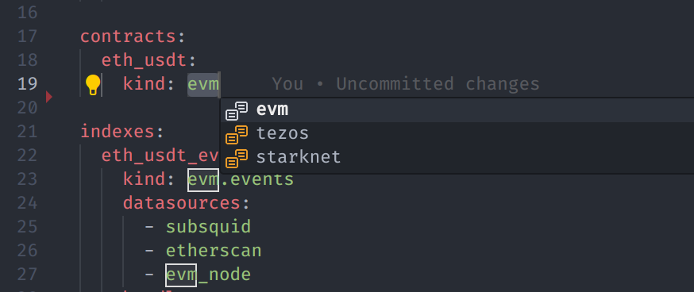

<!-- markdownlint-disable no-inline-html -->

# Release Notes: 8.0

Welcome to DipDup 8.0 release notes!

This major release contains lots of new features and improvements both for existing users and newcomers. Key highlights include Starknet support, updated Python 3.12 environment, improved performance, handler batching, new CLI commands. As always, developer experience is at the top of our list, so coding with DipDup 8.0 is more enjoyable than ever. After three months in beta stage, we consider the 8.0 branch polished enough for a stable release. This article will guide you through the most significant changes and show you how to upgrade your projects.

## Starknet support

GM, Starknet! 🐺

[Starknet](https://docs.starknet.io/) is a permissionless zero-knowledge (ZK) rollup on Ethereum, allowing developers to scale their dapps without compromising on security and composability of the Ethereum ecosystem.

We welcome Starknet to the large family of supported networks! DipDup 8.0 introduces a new index kind [`starknet.events`](../2.indexes/3.starknet_events.md) and new datasources [`starknet.subsquid`](../3.datasources/4.starknet_subsquid.md), [`starknet.node`](../3.datasources/5.starknet_node.md) to work with Starknet events.

Starknet smart contracts are written in [Cairo](https://github.com/starkware-libs/cairo) language. It's not EVM-compatible, but many concepts are similar. To start indexing Starknet events, you need to add a new index definition to the project config, then place the contract ABI to `abi/<typename>/cairo_abi.json` file and run `dipdup init` command to generate Python types and handler stubs. You can use [Starkscan](https://starkscan.co/contract/0x068f5c6a61780768455de69077e07e89787839bf8166decfbf92b645209c0fb8#class-code-history) explorer to get the ABI and other information about the contract. We are going to add support for automatic fetching ABIs from node in the future.

Follow the [Starknet Quickstart](../0.quickstart-starknet.md) guide to get started or run `dipdup new` and choose `demo_starknet_events` template.

## Updated Python 3.12 environment

DipDup indexers run in unified Python environment kept stable between releases to simplify deployment and maintenance. DipDup 8.0 introduces a major update including the following notable changes:

- [Python 3.12](https://docs.python.org/release/3.12.0/whatsnew/3.12.html) with the latest language features and performance improvements.
- [pydantic 2.9](https://docs.pydantic.dev/dev/migration/#migration-guide) with significantly faster (de)serialization and powerful validators.
- [tortoise-orm 0.21.6](https://tortoise.github.io/CHANGELOG.html) with better Pydantic integration and a bunch of bugfixes and optimizations.
- [web3-py 7.2](https://web3py.readthedocs.io/en/stable/migration.html#migrating-v6-to-v7) with the latest EIP and RPC changes.

Make sure to visit the docs of corresponding libraries to learn about the important changes.

## New config specification

DipDup 8.0 introduces an updated configuration specification for better flexibility and extensibility. Previously, every index definition was linked to a single "index datasource", which in turn could be linked to one or more complementary ones. This approach appeared to be limiting, and also confusing, since Subsquid and node RPC datasources could be used interchangeably despite the difference in indexing speed.

In the new spec version 3.0, an index can have any number of attached datasources. DipDup will choose the most suitable one for each stage of the process. For load balancing purposes, if multiple node datasources are attached, a random one will be chosen for each request. When applicable, DipDup will consider the order of datasources in the config file. The naming convention for index kinds has been updated to reflect these changes. They now consist of two parts: network and data type, without the datasource one.

```yaml
spec_version: 3.0  # <- was `2.0`
package: demo_evm_events

indexes:
  eth_usdt_events:
    kind: evm.events  # <- was `evm.subsquid.events`
    datasources:  # <- replacing `datasource` key
      - subsquid
      - etherscan
      - evm_node
      - another_evm_node
```

JSONSchema of DipDup config specification was uploaded to [SchemaStore](https://github.com/SchemaStore/schemastore) catalog. That means config file validation and auto-completion are available in major IDEs without additional configuration.

<!--  -->

## Handler batching

DipDup 8.0 introduces a new `batch` handler to modify higher-level indexing logic.  Examples could be skipping whole blocks by condition or recalculating some data between fixed intervals. Currently, the number of matched handlers in a single batch equals block, but the size of handler batch (and therefore database transaction) is going to be configurable in the future.

```python [handlers/batch.py]
async def batch(
    ctx: HandlerContext,
    handlers: Iterable[MatchedHandler],
) -> None:
    for handler in handlers:
        await ctx.fire_matched_handler(handler)
```

## Migration from 7.5

Existing projects require manual migration, but some steps are automated. Please follow the steps below to upgrade to 8.0.

1. Make sure you have Python 3.12 installed; `which python3.12` command will help you to check that.
2. Update the current DipDup installation. Run `dipdup self uninstall`, then `curl -Lsf https://dipdup.io/install.py | python3.12`.
3. Enter the project directory, but do not activate the virtual environment. Run the `dipdup migrate` command. It will update your config files and generate a new package structure. Modules requiring manual migration will be moved to `<module>.old` path; leave them as is for now. Review and commit the changes.
4. Run `dipdup init --base --force` command to update pyproject.toml and other metadata files. Recreate and enter the virtual environment. For PDM run `rm -rf .venv pdm.lock && pdm venv create python3.12 && pdm install && $(pdm venv activate)`. For Poetry run `rm -rf .venv poetry.lock && poetry install && poetry shell`. Review and commit the changes.
5. Move the callback function bodies from `<module>.old` to `<module>` files. Run `make all` to ensure that everything works as expected. Fix arrors if any, review and commit the changes for the last time.

DipDup 7.5 release is going to be supported for several months after the stable release of 8.0. During this period, we will provide bug fixes and security updates, but no new features will be added. End-of-Life date is going to be announced in advance.

{{ #include 9.release-notes/_8.0_changelog.md }}
{{ #include 9.release-notes/_footer.md }}
