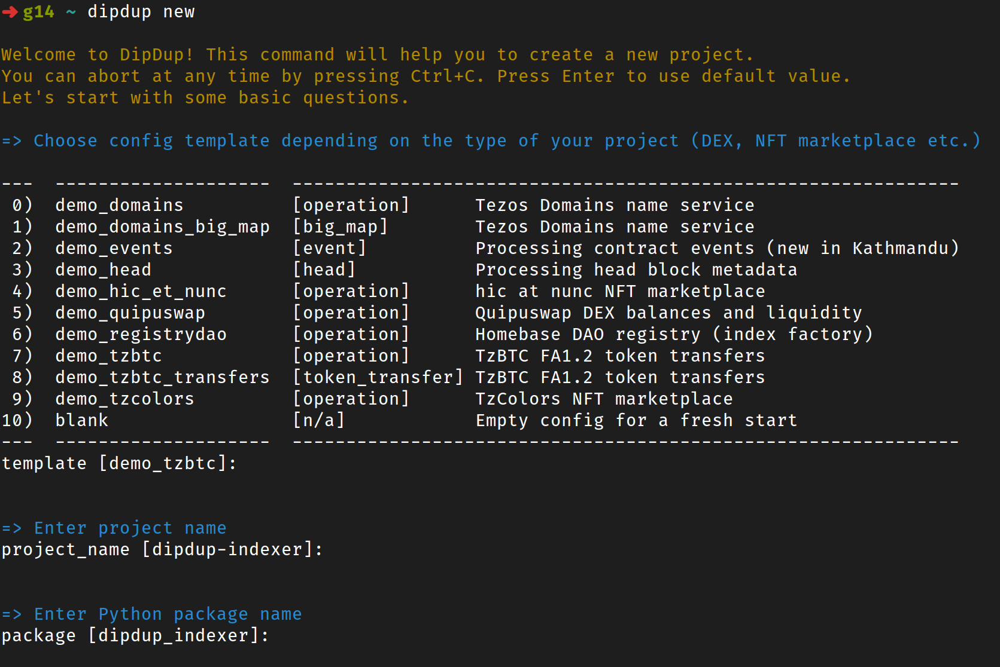

# Legacy Releases

This page contains release notes for legacy DipDup releases.

## 6.2.0

## What's New

### New interactive installer

Starting from this release, DipDup comes with an interactive installer to help you install necessary dependencies.

Run the command below in the terminal:

```shell
curl -Lsf https://dipdup.io/install.py | python3
```

Follow the instructions to complete the installation.

Now you have `dipdup` command available systemwide! Run it without arguments to see available commands.

You can use `dipdup install/update/uninstall` commands to manage the local installation.

### Project scaffolding

`dipdup new` command is now available to create a new project from a template. Run it and follow the questions; a new project will be created in the current directory. You can also use a replay file instead; see `dipdup new --help` for details.

<center></center>

### Kathmandu contract events

Kathmandu Tezos protocol upgrade has introduced [contract events](https://tezos.gitlab.io/alpha/event.html), a new way to interact with smart contracts. This index allows indexing events using strictly typed payloads. From the developer's perspective, it's similar to the `big_map` index with a few differences.

An example below is artificial since no known contracts in mainnet are currently using events.

```yaml [dipdup.yaml]
{{ #include ../src/demo_events/dipdup.yaml:23:32 }}
```

Unlike big maps, contracts may introduce new event tags and payloads at any time, so the index must be updated accordingly.

```python
{{ #include ../src/demo_events/handlers/on_move_event.py:7: }}
```

Each contract can have a fallback handler called for all unknown events so you can process untyped data.

```python
{{ #include ../src/demo_events/handlers/on_other_event.py:6: }}
```

## Changes since 5.1.3

### Added

- cli: `new` command to create a new project interactively.
- cli: `install/update/uninstall` commands to manage local DipDup installation.
- index: New index kind `event` to process contract events.
- install: New interactive installer based on pipx (`install.py` or `dipdup-install`).

### Fixed

- cli: Fixed commands that don't require a valid config yet crash with `ConfigurationError`.
- codegen: Fail on demand when `datamodel-codegen` is not available.
- codegen: Fixed Jinja2 template caching.
- config: Allow `sentry.dsn` field to be empty.
- config: Fixed greedy environment variable regex.
- hooks: Raise a `FeatureAvailabilityHook` instead of a warning when trying to execute hooks on SQLite.

### Improved

- cli: Detect `src/` layout when guessing package path.
- codegen: Improved cross-platform compatibility.
- config: `sentry.user_id` option to set user ID for Sentry (affects release adoption data).
- sentry: Detect environment when not set in config (docker/gha/tests/local)
- sentry: Expose more tags under the `dipdup` namespace.

### Performance

- cli: Up to 5x faster startup for some commands.

### Security

- sentry: Prevent Sentry from leaking hostname if `server_name` is not set.
- sentry: Notify about using Sentry when DSN is set or crash reporting is enabled.

### Other

- ci: A significantly faster execution of GitHub Actions.
- docs: Updated "Contributing Guide" page.


# 6.0.0

## ⚠ Breaking Changes

- Project models in `models.py` must be subclassed from `dipdup.models.Model` instead of `tortoise.Model`.
- The deprecated `on_rollback` event hook has been removed in favor of `on_index_rollback`.
- HTTP datasources no longer use caching. `cache show` and `cache clear` commands have been removed. `http.cache` config flag has been removed.
- `--logging-config` option has been removed. Use the `logging` config section or set up logging manually.
- Feature flag options of `run` command have been removed. Use the `advanced` config section instead.

## Migration from 5.x

- Replace `tortoise.Model` import with `dipdup.models.Model` in your `models.py` module.
- Remove the `on_rollback` event hook if it still persists in your project. Ensure that `on_index_rollback.py` contains `ctx.rollback` call, or remove it and call `dipdup init`.
- If you have used `buffer_size` config option, remove it to use database-level rollbacks.
- Run `schema approve` command with every schema you want to use with DipDup 6.0.  

## What's New

### Seamless database-level rollbacks

The era of handling chain reorgs manually is finally over! Now when DipDup receives a reorg message from TzKT it just rewinds a database to the previous state reverting changes in backtracked blocks level by level. To make this possible, DipDup catches all database modifications and saves diffs in a separate table, `dipdup_model_update` (you don't need to access it directly).

```python
# INSERT saved with no data, just drop this row on reorg.
trader = Trader(name='Alice', balance=100, active=True)
await trader.save()

# UPDATE saved with data old values to set them on reorg.
# Diff: {'balance': 100}
trader.balance = 200
await trader.save() 

# DELETE saved with full copy of data. On reorg this row will be recreated with the same PK.
# Diff: {'name': 'Alice', 'balance': 200, 'active': True}
await trader.delete()
```

Bulk class methods like `bulk_insert` and `bulk_update` are supported too. However, for raw queries, DipDup uses prefetching (additional SELECT) to save original values. So, `ReallyHugeTable.filter().delete()` will create efficiently a full copy of the table in `dipdup_model_update`. Most likely you will never need to perform such queries in handlers, but keep that detail in mind.

Since the Ithacanet protocol, only two last blocks may be backtracked. We do not need to store older diffs, they are removed automatically. If you need to keep more levels or disable this feature, adjust `rollback_depth` config option.

```yaml [dipdup.yaml]
advanced:
  rollback_depth: 2  # 0 to disable
```

`on_index_rollback` event hook now looks like this:

```python
from dipdup.context import HookContext
from dipdup.index import Index


async def on_index_rollback(
    ctx: HookContext,
    index: Index,  # type: ignore[type-arg]
    from_level: int,
    to_level: int,
) -> None:
    await ctx.execute_sql('on_index_rollback')
    await ctx.rollback(
        index=index.name,
        from_level=from_level,
        to_level=to_level,
    )
```

TzKT `buffer_size` option remains available, but it's not required to handle chain reorgs anymore.

### Crash dumps and automatic reporting

Now when DipDup catches unhandled exceptions, a crash dump will be saved to the temporary directory.

```
dipdup.exceptions.CallbackError: An error occurred during callback execution
________________________________________________________________________________

`demo_token.hooks.on_restart` callback execution failed:

  Exception:

Eliminate the reason of failure and restart DipDup.
________________________________________________________________________________

Crashdump saved to `/tmp/dipdup/crashdumps/veb7kz07.json`
```

This JSON file is the same data Sentry collects on crashes if integration is enabled. It includes a stack trace, local variables of each frame, and other information useful when investigating a crash. Attach this file when sending bug reports to GitHub Issues.

When preparing a crash dump Sentry can detect sensitive information like database passwords in the crash dump and remove it from the report. So it's generally safe to share the crash dump with the developers. Now you can also send these crash reports automatically to the Baking Bad team.

Your privacy matters; **crash reporting is disabled by default**. Simulate a crash with a random exception and inspect a crash dump before enabling this option to ensure that report doesn't contain secrets. Then add the following lines to your config:

```yaml [dipdup.yaml]
advanced:
  crash_reporting: True
```

## Changes since 5.2.5

### Added

- cli: Added `config export --full` flag to resolve templates before printing config.
- config: Added `advanced.crash_reporting` flag to enable reporting crashes to Baking Bad.
- config: Added `advanced.rollback_depth` field, a number of levels to keep in a database for rollback.
- context: Added `rollback` method to perform database rollback.
- database: Added an internal `ModelUpdate` model to store the latest database changes.
- dipdup: Save Sentry crashdump in `/tmp/dipdup/crashdumps/XXXXXXX.json` on a crash.

### Fixed

- config: Do not perform env variable substitution in commented-out lines.
- prometheus: Fixed updating `dipdup_index_handlers_matched_total` metric.

### Changed

- codegen: `on_index_rollback` hook calls `ctx.rollback` by default.
- database: Project models must be subclassed from `dipdup.models.Model`

### Removed

- cli: `--logging-config` option is removed.
- cli: All `run` command flags are removed. Use the `advanced` section of the config.
- cli: `cache show` and `cache clear` commands are removed.
- config: `http.cache` flag is removed.
- hooks: Removed deprecated `on_rollback` hook.
- index: Do not try to avoid single-level rollbacks by comparing operation hashes.

## 5.1.0

### Migration from 5.0 (optional)

* Run `init` command. Now you have two conflicting hooks: `on_rollback` and `on_index_rollback`. Follow the guide below to perform the migration. `ConflictingHooksError` exception will be raised until then.

### What's New

#### Per-index rollback hook

In this release, we continue to improve the rollback-handling experience, which became much more important since the Ithaca protocol reached mainnet. Let's briefly recap how DipDup currently processes chain reorgs _before_ calling a rollback hook:

1. If the `buffer_size` option of a TzKT datasource is set to a non-zero value, and there are enough data messages buffered when a rollback occurs, data is just dropped from the buffer, and indexing continues.
2. If all indexes in the config are `operation` ones, we can attempt to process a single-level rollback. All operations from rolled back block must be presented in the next one for rollback to succeed. If some operations are missing, the `on_rollback` hook will be called as usual.
3. Finally, we can safely ignore indexes with a level lower than the rollback target. The index level is updated either on synchronization or when at least one related operation or bigmap diff has been extracted from a realtime message.

If none of these tricks have worked, we can't process a rollback without custom logic. Here's where changes begin. Before this release, every project contained the `on_rollback` hook, which receives `datasource: IndexDatasource` argument and from/to levels. Even if your deployment has thousands of indexes and only a couple of them are affected by rollback, you weren't able to easily find out which ones.

Now `on_rollback` hook is deprecated and superseded by the `on_index_rollback` one. Choose one of the following options:

* You haven't touched the `on_rollback` hook since project creation. Run `init` command and remove `hooks/on_rollback` and `sql/on_rollback` directories in project root. Default action (reindexing) has not changed.
* You have some custom logic in `on_rollback` hook and want to leave it as-is for now. You can ignore introduced changes at least till the next major release.
* You have implemented per-datasource rollback logic and are ready to switch to the per-index one. Run `init`, move your code to the `on_index_rollback` hook and delete `on_rollback` one. Note, you can access rolled back datasource via `index.datasource`.

#### Token transfer index

Sometimes implementing an `operation` index is overkill for a specific task. An existing alternative is to use a `big_map` index to process only the diffs of selected big map paths. However, you still need to have a separate index for each contract of interest, which is very resource-consuming. A widespread case is indexing FA1.2/FA2 token contracts. So, this release introduces a new `token_transfer` index:

```yaml [dipdup.yaml]
indexes:
  transfers:
    kind: token_transfer
    datasource: tzkt
    handlers:
      - callback: transfers
```

The `TokenTransferData` object is passed to the handler on each operation, containing only information enough to process a token transfer.

#### `config env` command to generate env-files

Generally, It's good to separate a project config from deployment parameters, and DipDup has multiple options to achieve this. First of all, multiple configs can be chained successively, overriding top-level sections. Second, the DipDup config can contain docker-compose-style environment variable declarations. Let's say your config contains the following content:

```yaml [dipdup.yaml]
database:
  kind: postgres
  host: db
  port: 5432
  user: ${POSTGRES_USER:-dipdup}
  password: ${POSTGRES_PASSWORD:-changeme}
  database: ${POSTGRES_DB:-dipdup}
```

You can generate an env-file to use with this exact config:

```bash
$ dipdup -c dipdup.yml -c dipdup.docker.yml config env
POSTGRES_USER=dipdup
POSTGRES_PASSWORD=changeme
POSTGRES_DB=dipdup
```

The environment of your current shell is also taken into account:

```bash
$ POSTGRES_DB=foobar dipdup -c dipdup.yml -c dipdup.docker.yml config env
POSTGRES_USER=dipdup
POSTGRES_PASSWORD=changeme
POSTGRES_DB=foobar  # <- set from current env
```

Use `-f <filename>` option to save output on disk instead of printing to stdout. After you have modified the env-file according to your needs, you can apply it the way which is more convenient to you:

With dipdup `--env-file / -e` option:

```bash
dipdup -e prod.env <...> run
```

When using docker-compose:

```yaml [dipdup.yaml]
services:
  indexer:
    ...
    env_file: prod.env
```

#### Keeping framework up-to-date

A bunch of new tags is now pushed to the Docker Hub on each release in addition to the `X.Y.Z` one: `X.Y` and `X`. That way, you can stick to a specific release without the risk of leaving a minor/major update unattended (friends don't let friends use `latest` 😉). The `-pytezos` flavor is also available for each tag.

```docker
FROM dipdup/dipdup:5.1
...
```

In addition, DipDup will poll GitHub for new releases on each command which executes reasonably long and print a warning when running an outdated version. You can disable these checks with `advanced.skip_version_check` flag.

Pro tip: you can also enable notifications on the GitHub repo page with _👁 Watch -> Custom -> tick Releases -> Apply_ to never miss a fresh DipDup release.

### Changelog

See the full 5.1.0 changelog [here](../../CHANGELOG.md).

## 5.0.0

### ⚠ Breaking Changes

* Python versions 3.8 and 3.9 are no longer supported.
* `bcd` datasource has been removed.
* Two internal tables were added, `dipdup_contract_metadata` and `dipdup_token_metadata`.
* Some methods of `tzkt` datasource have changed their signatures and behavior.
* Dummy `advanced.oneshot` config flag has been removed.
* Dummy `schema approve --hashes` command flag has been removed.
* `docker init` command has been removed.
* `ReindexingReason` enumeration items have been changed.

### Migration from 4.x

* Ensure that you have a `python = "^3.10"` dependency in `pyproject.toml`.
* Remove `bcd` datasources from config. Use `metadata` datasource instead to fetch contract and token metadata.
* Update `tzkt` datasource method calls as described below.
* Run the `dipdup schema approve` command on every database you use with 5.0.0.
* Update usage of `ReindexingReason` enumeration if needed.

### What's New

#### Process realtime messages with lag

Chain reorgs have occurred much recently since the Ithaca protocol reached mainnet. The preferable way to deal with rollbacks is the `on_rollback` hook. But if the logic of your indexer is too complex, you can buffer an arbitrary number of levels before processing to avoid reindexing.

```yaml [dipdup.yaml]
datasources:
  tzkt_mainnet:
    kind: tzkt
    url: https://api.tzkt.io
    buffer_size: 2
```

DipDup tries to remove backtracked operations from the buffer instead emitting rollback. Ithaca guarantees operations finality after one block and blocks finality after two blocks, so to completely avoid reorgs, `buffer_size` should be 2.

#### BCD API takedown

Better Call Dev API was officially deprecated in February. Thus, it's time to go for `bcd` datasource. In DipDup, it served the only purpose of fetching contract and token metadata. Now there's a separate `metadata` datasource which do the same thing but better. If you have used `bcd` datasource for custom requests, see [How to migrate from BCD to TzKT API](https://baking-bad.org/blog/2022/02/15/migrating-from-bcd-api-to-tzkt-api/) article.

#### TzKT batch request pagination

Historically, most `TzktDatasource` methods had a page iteration logic hidden inside. The quantity of items returned by TzKT in a single request is configured in `HTTPConfig.batch_size` and defaulted to 10.000. Before this release, three requests would be performed by the `get_big_map` method to fetch 25.000 big map keys, leading to performance degradation and extensive memory usage.

| affected method | response size in 4.x | response size in 5.x |
|-|-|-|
| `get_similar_contracts` | unlimited | max. `datasource.request_limit` |
| `get_originated_contracts` | unlimited | max. `datasource.request_limit` |
| `get_big_map` | unlimited | max. `datasource.request_limit` |
| `get_contract_big_maps` | unlimited | max. `datasource.request_limit` |
| `get_quotes` | first `datasource.request_limit` | max. `datasource.request_limit` |

All paginated methods now behave the same way. You can either iterate over pages manually or use `iter_...` helpers.

```python
datasource = ctx.get_tzkt_datasource('tzkt_mainnet')
batch_iter = datasource.iter_big_map(
    big_map_id=big_map_id,
    level=last_level,
)
async for key_batch in batch_iter:
    for key in key_batch:
        ...
```

#### Metadata interface for TzKT integration

Starting with 5.0 you can store and expose custom contract and token metadata in the same format DipDup Metadata service does for TZIP-compatible metadata.

Enable this feature with `advanced.metadata_interface` flag, then update metadata in any callback:

```python
await ctx.update_contract_metadata(
    network='mainnet',
    address='KT1...',
    metadata={'foo': 'bar'},
)
```

Metadata stored in `dipdup_contract_metadata` and `dipdup_token_metadata` tables and available via GraphQL and REST APIs.

#### Prometheus integration

This version introduces initial Prometheus integration. It could help you set up monitoring, find performance issues in your code, and so on. To enable this integration, add the following lines to the config:

```yaml [dipdup.yaml]
prometheus:
  host: 0.0.0.0

```

### Changes since 4.2.7

#### Added

* config: Added `custom` section to store arbitrary user data.
* metadata: Added `metadata_interface` feature flag to expose metadata in TzKT format.
* prometheus: Added ability to expose Prometheus metrics.
* tzkt: Added ability to process realtime messages with lag.
* tzkt: Added missing fields to the `HeadBlockData` model.
* tzkt: Added `iter_...` methods to iterate over item batches.

#### Fixed

* config: Fixed default SQLite path (`:memory:`).
* prometheus: Fixed invalid metric labels.
* tzkt: Fixed pagination in several getter methods.
* tzkt: Fixed data loss when `skip_history` option is enabled.
* tzkt: Fixed crash in methods that do not support cursor pagination.
* tzkt: Fixed possible OOM while calling methods that support pagination.
* tzkt: Fixed possible data loss in `get_originations` and `get_quotes` methods.

#### Changed

* tzkt: Added `offset` and `limit` arguments to all methods that support pagination.

#### Removed

* bcd: Removed `bcd` datasource and config section.
* cli: Removed `docker init` command.
* cli: Removed dummy `schema approve --hashes` flag.
* config: Removed dummy `advanced.oneshot` flag.

#### Performance

* dipdup: Use fast `orjson` library instead of built-in `json` where possible.

## 4.2.0

### What's new

#### `ipfs` datasource

While working with contract/token metadata, a typical scenario is to fetch it from IPFS. DipDup now has a separate datasource to perform such requests.

```yaml [dipdup.yaml]
datasources:
  ipfs:
    kind: ipfs
    url: https://ipfs.io/ipfs
```

You can use this datasource within any callback. Output is either JSON or binary data.

```python
ipfs = ctx.get_ipfs_datasource('ipfs')

file = await ipfs.get('QmdCz7XGkBtd5DFmpDPDN3KFRmpkQHJsDgGiG16cgVbUYu')
assert file[:4].decode()[1:] == 'PDF'

file = await ipfs.get('QmSgSC7geYH3Ae4SpUHy4KutxqNH9ESKBGXoCN4JQdbtEz/package.json')
assert file['name'] == 'json-buffer'
```

You can tune HTTP connection parameters with the `http` config field, just like any other datasource.

#### Sending arbitrary requests

DipDup datasources do not cover all available methods of underlying APIs. Let's say you want to fetch protocol of the chain you're currently indexing from TzKT:

```python
tzkt = ctx.get_tzkt_datasource('tzkt_mainnet')
protocol_json = await tzkt.request(
    method='get',
    url='v1/protocols/current',
    cache=False,
    weight=1,  # ratelimiter leaky-bucket drops
)
assert protocol_json['hash'] == 'PtHangz2aRngywmSRGGvrcTyMbbdpWdpFKuS4uMWxg2RaH9i1qx'
```

Datasource HTTP connection parameters (ratelimit, backoff, etc.) are applied on every request.

#### Firing hooks outside of the current transaction

When configuring a hook, you can instruct DipDup to wrap it in a single database transaction:

```yaml [dipdup.yaml]
hooks:
  my_hook:
    callback: my_hook
    atomic: True
```

Until now, such hooks could only be fired according to `jobs` schedules, but not from a handler or another atomic hook using `ctx.fire_hook` method. This limitation is eliminated - use `wait` argument to escape the current transaction:

```python
async def handler(ctx: HandlerContext, ...) -> None:
    await ctx.fire_hook('atomic_hook', wait=False)
```

#### Spin up a new project with a single command

Cookiecutter is an excellent `jinja2` wrapper to initialize hello-world templates of various frameworks and toolkits interactively. Install `python-cookiecutter` package systemwide, then call:

```shell
cookiecutter https://github.com/dipdup-io/cookiecutter-dipdup
```

#### Advanced scheduler configuration

DipDup utilizes `apscheduler` library to run hooks according to schedules in `jobs` config section. In the following example, `apscheduler` spawns up to three instances of the same job every time the trigger is fired, even if previous runs are in progress:

```yaml [dipdup.yaml]
advanced:
  scheduler:
    apscheduler.job_defaults.coalesce: True
    apscheduler.job_defaults.max_instances: 3
```

See [`apscheduler` docs](https://apscheduler.readthedocs.io/en/stable/userguide.html#configuring-the-scheduler) for details.

Note that you can't use executors from `apscheduler.executors.pool` module - `ConfigurationError` exception raised then. If you're into multiprocessing, I'll explain why in the next paragraph.

#### About the present and future of multiprocessing

It's impossible to use `apscheduler` pool executors with hooks because `HookContext` is not pickle-serializable. So, they are forbidden now in `advanced.scheduler` config. However, thread/process pools can come in handy in many situations, and it would be nice to have them in DipDup context. For now, I can suggest implementing custom commands as a workaround to perform any resource-hungry tasks within them. Put the following code in `{{ project.package }}/cli.py`:

```python
from contextlib import AsyncExitStack

import asyncclick as click
from dipdup.cli import cli, cli_wrapper
from dipdup.config import DipDupConfig
from dipdup.context import DipDupContext
from dipdup.utils.database import tortoise_wrapper


@cli.command(help='Run heavy calculations')
@click.pass_context
@cli_wrapper
async def do_something_heavy(ctx):
    config: DipDupConfig = ctx.obj.config
    url = config.database.connection_string
    models = f'{config.package}.models'

    async with AsyncExitStack() as stack:
        await stack.enter_async_context(tortoise_wrapper(url, models))
        ...

if __name__ == '__main__':
    cli(prog_name='dipdup', standalone_mode=False)
```

Then use `python -m {{ project.package }}.cli` instead of `dipdup` as an entrypoint. Now you can call `do-something-heavy` like any other `dipdup` command. `dipdup.cli:cli` group handles arguments and config parsing, graceful shutdown, and other boilerplate. The rest is on you; use `dipdup.dipdup:DipDup.run` as a reference. And keep in mind that Tortoise ORM is not thread-safe. I aim to implement `ctx.pool_apply` and `ctx.pool_map` methods to execute code in pools with _magic_ within existing DipDup hooks, but no ETA yet.

That's all, folks! As always, your feedback is very welcome 🤙

## 4.1.0

### Migration from 4.0 (optional)

* Run `dipdup schema init` on the existing database to enable `dipdup_head_status` view and REST endpoint.

### What's New

#### Index only the current state of big maps

`big_map` indexes allow achieving faster processing times than `operation` ones when storage updates are the only on-chain data your dapp needs to function. With this DipDup release, you can go even further and index only the current storage state, ignoring historical changes.

```yaml [dipdup.yaml]
indexes:
  foo:
    kind: big_map
    ...
    skip_history: never|once|always
```

When this option is set to `once`, DipDup will skip historical changes only on initial sync and switch to regular indexing afterward. When the value is `always`, DipDup will fetch all big map keys on every restart. Preferable mode depends on your workload.

All big map diffs DipDup pass to handlers during fast sync have `action` field set to `BigMapAction.ADD_KEY`. Keep in mind that DipDup fetches all keys in this mode, including ones removed from the big map. If needed, you can filter out the latter by `BigMapDiff.data.active` field.

#### New datasource for contract and token metadata

Since the first version DipDup allows to fetch token metadata from Better Call Dev API with `bcd` datasource. Now it's time for a better solution. Firstly, BCD is far from being reliable in terms of metadata indexing. Secondly, spinning up your own instance of BCD requires significant effort and computing power. Lastly, we plan to deprecate Better Call Dev API soon (but do not worry - it won't affect the explorer frontend).

Luckily, we have [dipdup-metadata](https://github.com/dipdup-io/metadata), a standalone companion indexer for DipDup written in Go. Configure a new datasource in the following way:

```yaml [dipdup.yaml]
datasources:
  metadata:
    kind: metadata
    url: https://metadata.dipdup.net
    network: mainnet|ghostnet|limanet
```

Now you can use it anywhere in your callbacks:

```python
datasource = ctx.datasources['metadata']
token_metadata = await datasource.get_token_metadata(address, token_id)
```

`bcd` datasource will remain available for a while, but we discourage using it for metadata processing.

#### Nested packages for hooks and handlers

Callback modules are no longer have to be in top-level `hooks`/`handlers` directories. Add one or multiple dots to the callback name to define nested packages:

```yaml [dipdup.yaml]
package: indexer
hooks:
  foo.bar:
    callback: foo.bar
```

After running `init` command, you'll get the following directory tree (shortened for readability):

```
indexer
├── hooks
│   ├── foo
│   │   ├── bar.py
│   │   └── __init__.py
│   └── __init__.py
└── sql
    └── foo
        └── bar
            └── .keep
```

The same rules apply to handler callbacks. Note that `callback` field must be a valid Python package name - lowercase letters, underscores, and dots.

#### New CLI commands and flags

* `schema init` is a new command to prepare a database for running DipDup. It will create tables based on your models, then call `on_reindex` SQL hook to finish preparation - the same things DipDup does when run on a clean database.

* `hasura configure --force` flag allows to configure Hasura even if metadata hash matches one saved in database. It may come in handy during development.

* `init --keep-schemas` flag makes DipDup preserve contract JSONSchemas. Usually, they are removed after generating typeclasses with `datamodel-codegen`, but you can keep them to convert to other formats or troubleshoot codegen issues.

#### Built-in `dipdup_head_status` view and REST endpoint

DipDup maintains several internal models to keep its state. As Hasura generates GraphQL queries and REST endpoints for those models, you can use them for monitoring. However, some SaaS monitoring solutions can only check whether an HTTP response contains a specific word or not. For such cases `dipdup_head_status` view was added - a simplified representation of `dipdup_head` table. It returns `OK` when datasource received head less than two minutes ago and `OUTDATED` otherwise. Latter means that something's stuck, either DipDup (e.g., because of database deadlock) or TzKT instance. Or maybe the whole Tezos blockchain, but in that case, you have problems bigger than indexing.

```shell
$ curl "http://127.0.0.1:41000/api/rest/dipdupHeadStatus?name=https%3A%2F%2Fapi.tzkt.io" 
{"dipdupHeadStatus":[{"status":"OUTDATED"}]}%
```

Note that `dipdup_head` update may be delayed during sync even if the `--early-realtime` flag is enabled, so don't rely exclusively on this endpoint.

### Changelog

#### Added

* cli: Added `schema init` command to initialize database schema.
* cli: Added `--force` flag to `hasura configure` command.
* codegen: Added support for subpackages inside callback directories.
* hasura: Added `dipdup_head_status` view and REST endpoint.
* index: Added an ability to skip historical data while synchronizing `big_map` indexes.
* metadata: Added `metadata` datasource.
* tzkt: Added `get_big_map` and `get_contract_big_maps` datasource methods.

## 4.0.0

### ⚠ Breaking Changes

* `run --oneshot` option is removed. The oneshot mode (DipDup stops after the sync is finished) applies automatically when `last_level` field is set in the index config.
* `clear-cache` command is removed. Use `cache clear` instead.

### Migration from 3.x

* Run `dipdup init` command to generate `on_synchronized` hook stubs.
* Run `dipdup schema approve` command on every database you want to use with 4.0.0. Running `dipdup migrate` is not necessary since `spec_version` hasn't changed in this release.

### What's New

#### Performance optimizations

Overall indexing performance has been significantly improved. Key highlights:

* Configuration files are loaded 10x times faster. The more indexes in the project, the more noticeable difference is.
* Significantly reduced CPU usage in realtime mode.
* Datasource default HTTP connection options optimized for a reasonable balance between resource consumption and indexing speed.

Also, two new flags were added to improve DipDup performance in several scenarios: `merge_subscriptions` and `early_relatime`.  See [this paragraph](#new-cli-commands-and-flags) for details.

#### Configurable action on reindex

There are several reasons that trigger reindexing:

|reason|description|
|-|-|
|`manual`|Reindexing triggered manually from callback with `ctx.reindex`.|
|`migration`|Applied migration requires reindexing. Check release notes before switching between major DipDup versions to be prepared.|
|`rollback`|Reorg message received from TzKT, and can not be processed.|
|`config_modified`|One of the index configs has been modified.|
|`schema_modified`|Database schema has been modified. Try to avoid manual schema modifications in favor of [SQL hooks](../5.advanced/3.sql.md)|

Now it is possible to configure desirable action on reindexing triggered by the specific reason.

|action|description|
|-|-|
|`exception` (default)|Raise `ReindexingRequiredError` and quit with error code. The safest option since you can trigger reindexing accidentally, e.g., by a typo in config. Don't forget to set up the correct restart policy when using it with containers. |
|`wipe`|Drop the whole database and start indexing from scratch. Be careful with this option!|
|`ignore`|Ignore the event and continue indexing as usual. It can lead to unexpected side-effects up to data corruption; make sure you know what you are doing.

To configure actions for each reason, add the following section to DipDup config:

```yaml [dipdup.yaml]
advanced:
  reindex:
    manual: wipe
    migration: exception
    rollback: ignore
    config_modified: exception
    schema_modified: exception
```

#### New CLI commands and flags

|command or flag|description|
|-|-|
| `cache show` | Get information about file caches used by DipDup.
| `config export` | Print config after resolving all links and variables. Add `--unsafe` option to substitute environment variables; default values from config will be used otherwise. |
| `run --early-realtime` | Establish a realtime connection before all indexes are synchronized. |
| `run --merge-subscriptions` | Subscribe to all operations/big map diffs during realtime indexing. This flag helps to avoid reaching TzKT subscriptions limit (currently 10000 channels). Keep in mind that this option could significantly improve RAM consumption depending on the time required to perform a sync. |
| `status` | Print the current status of indexes from the database. |

### `advanced` top-level config section

This config section allows users to tune system-wide options, either experimental or unsuitable for generic configurations.

|field|description|
|-|-|
|`early_realtime`<br>`merge_subscriptions`<br>`postpone_jobs` |Another way to set `run` command flags. Useful for maintaining per-deployment configurations. |
|`reindex`|Configure action on reindexing triggered. See [this paragraph](#configurable-action-on-reindex) for details.|

CLI flags have priority over self-titled `AdvancedConfig` fields.

#### `aiosignalrcore` replaced with `pysignalr`

It may not be the most noticeable improvement for end-user, but it still deserves a separate paragraph in this article.

Historically, DipDup used our own fork of `signalrcore` library named `aiosignalrcore`. This project aimed to replace the synchronous `websocket-client` library with asyncio-ready `websockets`. Later we discovered that required changes make it hard to maintain backward compatibility, so we have decided to rewrite this library from scratch. So now you have both a modern and reliable library for SignalR protocol and a much more stable DipDup. Ain't it nice?

### Changes since 3.1.3

This is a combined changelog of -rc versions released since the last stable release until this one.

#### Added

* cli: Added `run --early-realtime` flag to establish a realtime connection before all indexes are synchronized.
* cli: Added'run --merge-subscriptions`  flag to subscribe to all operations/big map diffs during realtime indexing.
* cli: Added `status` command to print the current status of indexes from the database.
* cli: Added `config export [--unsafe]` command to print config after resolving all links and variables.
* cli: Added `cache show` command to get information about file caches used by DipDup.
* config: Added `first_level` and `last_level` optional fields to `TemplateIndexConfig`. These limits are applied after ones from the template itself.
* config: Added `daemon` boolean field to `JobConfig` to run a single callback indefinitely. Conflicts with `crontab` and `interval` fields.
* config: Added `advanced` top-level section.
* hooks: Added `on_synchronized` hook, which fires each time all indexes reach realtime state.

#### Fixed

* cli: Fixed config not being verified when invoking some commands.
* cli: Fixed crashes and output inconsistency when piping DipDup commands.
* cli: Fixed missing `schema approve --hashes` argument.
* cli: Fixed `schema wipe --immune` flag being ignored.
* codegen: Fixed contract address used instead of an alias when typename is not set.
* codegen: Fixed generating callback arguments for untyped operations.
* codegen: Fixed missing imports in handlers generated during init.
* coinbase: Fixed possible data inconsistency caused by caching enabled for method `get_candles`.
* hasura: Fixed unnecessary reconfiguration in restart.
* http: Fixed increasing sleep time between failed request attempts.
* index: Fixed `CallbackError` raised instead of `ReindexingRequiredError` in some cases.
* index: Fixed crash while processing storage of some contracts.
* index: Fixed incorrect log messages, remove duplicate ones.
* index: Fixed invocation of head index callback.
* index: Fixed matching of untyped operations filtered by `source` field ([@pravin-d](https://github.com/pravin-d)).
* tzkt: Fixed filtering of big map diffs by the path.
* tzkt: Fixed `get_originated_contracts` and `get_similar_contracts` methods whose output was limited to `HTTPConfig.batch_size` field.
* tzkt: Fixed lots of SignalR bugs by replacing `aiosignalrcore` library with `pysignalr`.
* tzkt: Fixed processing operations with entrypoint `default`.
* tzkt: Fixed regression in processing migration originations.
* tzkt: Fixed resubscribing when realtime connectivity is lost for a long time.
* tzkt: Fixed sending useless subscription requests when adding indexes in runtime.

#### Changed

* cli: `schema wipe` command now requires confirmation when invoked in the interactive shell.
* cli: `schema approve` command now also causes a recalculation of schema and index config hashes.
* index: DipDup will recalculate respective hashes if reindexing is triggered with `config_modified: ignore` or `schema_modified: ignore` in advanced config.

#### Removed

* cli: Removed deprecated `run --oneshot` argument and `clear-cache` command.

#### Performance

* config: Configuration files are loaded 10x times faster.
* index: Checks performed on each iteration of the main DipDup loop are slightly faster now.
* index: Number of operations processed by matcher reduced by 40%-95% depending on the number of addresses and entrypoints used.
* tzkt: Improved performance of response deserialization.
* tzkt: Rate limit was increased. Try to set `connection_timeout` to a higher value if requests fail with `ConnectionTimeout` exception.
