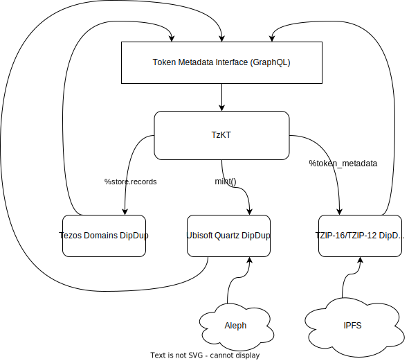

# Metadata Interface

When issuing a token on Tezos blockchain, there is an important yet not enough covered aspect related to how various ecosystem applications (wallets, explorers, marketplaces, and others) will display and interact with it. It's about token metadata, stored wholly or partially on-chain but intended for off-chain use only.

## Token metadata standards

There are several standards regulating the metadata file format and the way it can be stored and exposed to consumers:

* [TZIP-21 | Rich Metadata](https://tzip.tezosagora.org/proposal/tzip-21/) — describes a metadata schema and standards for contracts and tokens
* [TZIP-12 | FA2.0](https://tzip.tezosagora.org/proposal/tzip-12/) — a standard for a unified token contract interface, includes an article about how to store and encode token metadata
* [TZIP-7 | FA1.2](https://tzip.tezosagora.org/proposal/tzip-7/) — single asset token standard; reuses the token metadata approach from FA2.0

Keeping aside the metadata schema, let's focus on which approaches for storing are currently standardized, their pros and cons, and what to do if any of the options available do not fit your case.

### Basic: on-chain links / off-chain storage

The most straightforward approach is to store everything in the contract storage, especially if it's just the basic fields (name, symbol, decimals):

```text
storage
└── token_metadata [big_map]
    └── 0
        ├── token_id: 0
        └── token_info
            ├── name: ""
            ├── symbol: ""
            └── decimals: ""
```

But typically, you want to store more like a token thumbnail icon, and it is no longer feasible to keep such large data on-chain (because you pay gas for every byte stored).  
Then you can put large files somewhere off-chain (e.g., IPFS) and store just links:

```text
storage
└── token_metadata [big_map]
    └── 0
        ├── token_id: 0
        └── token_info
            ├── ...
            └── thumbnailUri: "ipfs://"
```

This approach is still costly, but sometimes (in rare cases), you need to have access to the metadata from the contract (example: [Dogami](https://tzkt.io/KT1NVvPsNDChrLRH5K2cy6Sc9r1uuUwdiZQd/storage/115420)).  
We can go further and put the entire token info structure to IPFS:

```text
storage
└── token_metadata [big_map]
    └── 0
        ├── token_id: 0
        └── token_info
            └── "": "ipfs://"
```

It is the most common case right now (example: [HEN](https://tzkt.io/KT1RJ6PbjHpwc3M5rw5s2Nbmefwbuwbdxton/storage/514)).  

The main advantage of the basic approach is that all the changes applied to token metadata will result in big map diffs that are easily traceable by indexers. Even if you decide to replace the off-chain file, it will cause the IPFS link to change. In the case of HTTP links, indexers cannot detect the content change; thus, token metadata won't be updated.

### Custom: off-chain view

The second approach presented in the TZIP-12 spec was intended to cover the cases when there's a need in reusing the same token info or when it's not possible to expose the `%token_metadata` big map in the standard form. Instead, it's offered to execute a special Michelson script against the contract storage and treat the result as the token info for a particular token (requested). The tricky part is that the script code itself is typically stored off-chain, and the whole algorithm would look like this:

1. Try to fetch the empty string key of the `%metadata` big map to retrieve the [TZIP-16](https://tzip.tezosagora.org/proposal/tzip-16/) file location
2. Resolve the TZIP-16 file (typically from IPFS) — it should contain the off-chain view body
3. Fetch the current contract storage
4. Build arguments for the off-chain view `token_metadata` using fetched storage and
5. Execute the script using Tezos node RPC

Although this approach is more or less viable for wallets (when you need to fetch metadata for a relatively small amount of tokens), it becomes very inefficient for indexers dealing with millions of tokens:

* After every contract origination, one has to try to fetch the views (even if there aren't any) — it means synchronous fetching, which can take seconds in the case of IPFS
* Executing a Michelson script is currently only* possible via Tezos node, and it's quite a heavy call (setting up the VM and contract context takes time)
* There's no clear way to detect new token metadata addition or change — that is actually the most critical one; you never know for sure when to call the view

Off-chain view approach is not supported by [TzKT](https://tzkt.io/) indexer, and we strongly recommend not to use it, especially for contracts that can issue multiple tokens.

## DipDup-based solution

The alternative we offer for the very non-standard cases is using our selective indexing framework for custom token metadata retrieval and then feeding it back to the TzKT indexer, which essentially acts as a metadata aggregator. Note that while this can seem like a circular dependency, it's resolved on the interface level: all custom DipDup metadata indexers should expose specific GraphQL tables with certain fields:

```js
query MyQuery {
  token_metadata() {
    metadata    // TZIP-21 JSON
    network     // mainnet or <protocol>net
    contract    // token contract address
    token_id    // token ID in the scope of the contract
    update_id   // integer cursor used for pagination
  }
}
```

DipDup handles table management for you and exposes a [context-level helper](../advanced/context.md).

Tezos Domains example:

```python
await ctx.update_token_metadata(
    network=ctx.datasource.network,
    address=store_records.data.contract_address,
    token_id=token_id,
    metadata={
        'name': record_name,
        'symbol': 'TD',
        'decimals': '0',
        'isBooleanAmount': True,
        'domainData': decode_domain_data(store_records.value.data)
    },
)
```

TzKT can be configured to subscribe to one or multiple DipDup metadata sources, currently we use in production:

* Generic TZIP-16/TZIP-12 metadata indexer [Github](https://github.com/dipdup-net/metadata) | [Playground](https://play.dipdup.io/)
* Tezos Domains metadata indexer [Github](https://github.com/dipdup-net/tezos-domains) | [Playground](https://play.dipdup.io/)
* Ubisoft Quartz metadata indexer [Github](https://github.com/dipdup-net/quartz-metadata) | [Playground](https://play.dipdup.io/)


