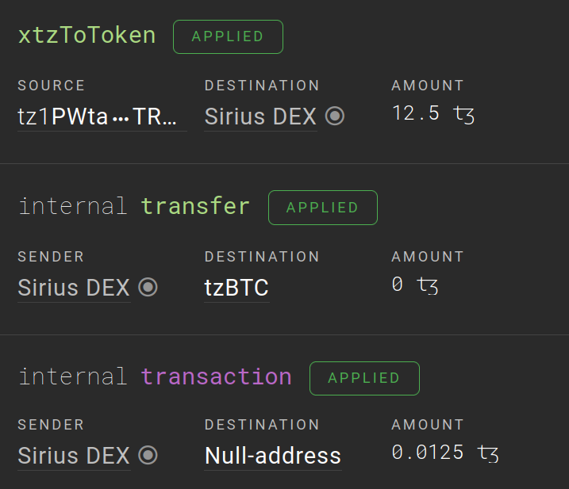

<div class="float-img">
  
  
</div>

# operation

Operation index allows you to query only operations related to your dapp and match them with handlers by content. A single contract call consists of implicit operation and, optionally, internal operations. For each of them, you can specify a handler that will be called when operation group. As a result, you get something like an event log for your dapp.

## Filters

DipDup supports filtering operations by `source`, `destination` (if applicable), and `originated_contract` (if applicable).

DipDup fetches only _applied_ operations.

### contracts

```yaml
indexes:
  my_index:
    kind: operation
    datasource: tzkt
    contracts:
      - contract1
      - contract2
```

In this example, DipDup will fetch all the operations where any of source and destination is equal to either _contract1_ or _contract2_ address. `contracts` field is obligatory, there has to be at least one contract alias (from the [inventory](../contracts.md)).

### types

By default, DipDup works only with transactions, but you can explicitly list operation types you want to subscribe to (currently `transaction`, `origination` and `migration` types are supported):

```yaml
indexes:
  my_index:
    kind: operation
    datasource: tzkt
    contracts:
      - some_contract
    types:
      - transaction
      - origination
```

Note that in the case of originations, DipDup will query operations where either source or originated contract address is equal to _some\_contract_.

## Handlers

Each operation handler contains two required fields:

* `callback` —  name of the _async_ function with a particular signature; DipDup will create it on init and in the module with the same name `<package_name>.handlers.<callback>`.
* `pattern` — a non-empty list of items that need to be matched.

```yaml
indexes:
  my_index:
    kind: operation
    datasource: tzkt
    contracts:
      - some_contract
    handlers:
      - callback: on_call
        pattern:
          - destination: some_contract
            entrypoint: transfer
```

You can think of operation pattern as a regular expression on a sequence of operations (both external and internal) with global flag enabled (can be multiple matches) and where various operation parameters (type, source, destination, entrypoint, originated contract) are used for matching.

### Pattern

Here are the supported filters for matching operations (all optional):

* `type` — _transaction_ or _origination_; usually inferred from the existence of other fields
* `destination` — invoked contract alias (from the [inventory](../contracts.md))
* `entrypoint` — invoked entrypoint name
* `source` — operation sender alias (from the [inventory](../contracts.md))
* `originated_contract` — originated contract alias (from the [inventory](../contracts.md))
* `similar_to` — originated contract has the same parameter and storage types as the reference one (from the [inventory](../contracts.md))
* `strict` — stronger the `similar_to` filter by comparing the entire code rather than just parameter+storage
* `optional` — continue matching even if this item is not found (with limitations, see below)

It's unnecessary to match the entire operation content; you can skip external/internal calls that are not relevant. However, there is a limitation: optional items cannot be followed by operations ignored by the pattern.

```yaml
pattern:
  # Implicit transaction
  - destination: some_contract
    entrypoint: mint

  # Internal transactions below
  - destination: another_contract
    entrypoint: transfer

  - source: some_contract
    type: transaction
```

You will get slightly different callback argument types depending on whether you specify _destination+entrypoint_ for transactions and _originated\_contract_ for originations. Namely, in the first case, DipDup will generate the dataclass for a particular entrypoint/storage, and in the second case not (meaning you will have to handle untyped parameters/storage updates).
