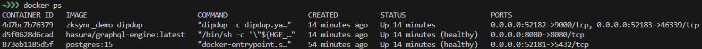
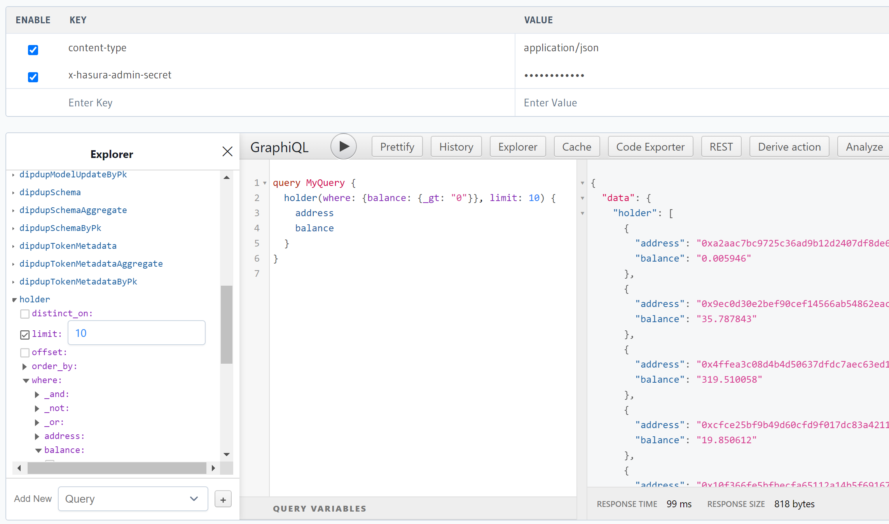

# DipDup

This page will guide you through the steps to get your first DipDup indexer up and running in a few minutes without getting too deep into the details.

Let's create an indexer to track balances of particular token. We will need to set up the indexing environment, configure the indexer, and store the results in a database.

## Prerequisites

Here are a few things you need to get started with DipDup:

- **Skills**: Basic Python 3 knowledge to implement data handlers.
- **Operating System**: You can use any Linux/macOS distribution on amd64/arm64 platforms with Python installed.
- **Python Version**: Python 3.11 is required for DipDup. You can check your Python version by running `python3 --version` in your terminal.

## Understanding DipDup

DipDup is a software framework that helps web3 developers create selective indexers for decentralized applications. It uses blockchain data provided by various off-chain data sources. Some of the key features of DipDup include:

- **Ready For Multichain**: DipDup supports dozens of blockchains, and we are constantly adding new ones. You can easily reuse your business logic for different networks or even index multiple chains in a single project.
- **Declarative Configuration**: A whole indexer is defined by a single configuration file and a bunch of Python data handlers. Code is completely separated from the configuration and environment variables, making it easy to maintain and deploy your project.
- **Lots of Integrations**: You can use SQLite, PostgreSQL, or TimescaleDB databases to store blockchain data, deploy to Compose or Swarm with a single command, monitor your indexer with Prometheus or Sentry, and more.
- **Magic GraphQL API**: DipDup automatically generates a GraphQL API for your data using Hasura, so you can easily query it from your frontend or other services. You can easily extend API with custom queries and metadata requests.
- **Powerful CLI**: DipDup CLI has everything you need to manage your project, from creating a new one to running and deploying. And it's very convenient. There are lots of templates for various blockchains and use cases, so you can start quickly.

## Step 1 — Install DipDup

The easiest way to install DipDup as a CLI application is [pipx](https://pipx.pypa.io/stable/) with `pipx install dipdup` command. If you don't want to deal with tooling, we have a convenient installer script. Run the following command in your terminal:

```shell [Terminal]
curl -Lsf https://dipdup.io/install.py | python3
```

See the [Installation](https://dipdup.io/docs/installation) page for other options.

## Step 2 — Create a project

DipDup CLI has a built-in project generator. Run the following command in your terminal:

```shell [Terminal]
dipdup new
```

In this guide we will use one of our demos - demo_evm_events as a template:


Dipdup will generate complete project structure, including USDT balances tracking logic, which is implemented in demo. Let's look further into it in following steps.

## Step 3 — Configuration file

In the project root, you'll find a file named `dipdup.yaml`. It's the main configuration file of your indexer. We will discuss it in detail in the [Config](https://dipdup.io/docs/getting-started/config) section; for now just replace contract address with target token, I will use zkSync USDT for this example:

```yaml [dipdup.yaml]
spec_version: 2.0
package: zksync_demo

datasources:
  subsquid:
    kind: evm.subsquid
    url: ${SUBSQUID_URL:-https://v2.archive.subsquid.io/network/ethereum-mainnet}
    node: evm_node
  etherscan:
    kind: abi.etherscan
    url: ${ETHERSCAN_URL:-https://api.etherscan.io/api}
    api_key: ${ETHERSCAN_API_KEY:-''}
  evm_node:
    kind: evm.node
    url: ${NODE_URL:-https://eth-mainnet.g.alchemy.com/v2}/${NODE_API_KEY:-''}
    ws_url: ${NODE_WS_URL:-wss://eth-mainnet.g.alchemy.com/v2}/${NODE_API_KEY:-''}

contracts:
  eth_usdt:
    kind: evm
    address: 0x493257fD37EDB34451f62EDf8D2a0C418852bA4C
    typename: eth_usdt

indexes:
  eth_usdt_events:
    kind: evm.subsquid.events
    datasource: subsquid
    handlers:
      - callback: on_transfer
        contract: eth_usdt
        name: Transfer
```

## Step 4 — Implement handlers

Now, let's examine `handlers/on_transfer.py`. As defined in `dipdup.yaml`, this handler is activated when the transfer method of the token contract is called. In this guide, we focus on tracking USDT balances on zkSync:

```yaml [on_transfer.py]
from decimal import Decimal

from tortoise.exceptions import DoesNotExist

from zksync_demo import models as models
from zksync_demo.types.eth_usdt.evm_events.transfer import Transfer
from dipdup.context import HandlerContext
from dipdup.models.evm_subsquid import SubsquidEvent


async def on_transfer(
    ctx: HandlerContext,
    event: SubsquidEvent[Transfer],
) -> None:
    amount = Decimal(event.payload.value) / (10**6)
    if not amount:
        return

    await on_balance_update(
        address=event.payload.from_,
        balance_update=-amount,
        level=event.data.level,
    )
    await on_balance_update(
        address=event.payload.to,
        balance_update=amount,
        level=event.data.level,
    )
    

async def on_balance_update(
    address: str,
    balance_update: Decimal,
    level: int,
) -> None:
    try:
        holder = await models.Holder.cached_get(pk=address)
    except DoesNotExist:
        holder = models.Holder(
            address=address,
            balance=0,
            turnover=0,
            tx_count=0,
            last_seen=None,
        )
        holder.cache()
    holder.balance += balance_update
    holder.turnover += abs(balance_update)
    holder.tx_count += 1
    holder.last_seen = level
    await holder.save()
```

Notice that we utilize the Transaction model predefined in `models/__init__.py`. DipDup is compatible with several databases, including SQLite, PostgreSQL, and TimescaleDB, thanks to a custom ORM layer built on top of Tortoise ORM. For more information on DipDup's data models and how to utilize them in your projects, visit the [models page in our docs](https://dipdup.io/docs/getting-started/models).

## Step 5 — Run

In 'dipdup.yaml' we have three datasources, in this tutorial we will use two of them: Subsquid Network for historical data and JSON-RPC API (EVM node) for real-time and historical data.
Before running, set URLs for datasources. These URLs can be set in `dipdup.yaml`, but here we suggest better .env file approach:

  1. Copy `deploy/.env.default` file to `deploy/.env`.  
  2. Set `SUBSQUID_URL=https://v2.archive.subsquid.io/network/zksync-mainnet`.
  3. Set your EVM node, for this example I will use the public RPC endpoint: `NODE_URL=https://mainnet.era.zksync.io`, `NODE_WS_URL=wss://mainnet.era.zksync.io`.

Start the indexer:

```shell [Terminal]
dipdup -e deploy/.env -c dipdup.yaml -c configs/dipdup.sqlite.yaml run
```

Data will be stored in SQLite database. Run this query to check the data:

```bash
sqlite3 /tmp/zksync_demo.sqlite 'SELECT * FROM holder LIMIT 10'
```

The next part of the guide will explain how to start production-ready DipDup application in Docker environment with GraphQL API for your data.

### Query API

Most powerful and common DipDup application configuration uses PostgreSQL to store data and Hasura to have production ready API, steps to deploy stack in Docker environment in a few simple steps:

  1. Generate and set `HASURA_SECRET` and `POSTGRES_PASSWORD` in `deploy/.env` file, Hasura secret will be used later to access Hasura.
  2. Build and start Docker containers: `docker compose --env-file deploy/.env -f deploy/compose.yaml up -d`.
  3. Run `docker ps` to check that all containers are running. Locate the URL of the Hasura console in the PORTS column [compose.yml documentation](https://docs.docker.com/compose/compose-file/compose-file-v3/#ports). If the container isn't accessible via `0.0.0.0:PORT`, it may be accessible via `localhost:PORT` in certain environments.
  
  4. As an example, let's query the first 10 addresses with a positive balance:
  

## Explore DipDup

To learn more about DipDup features, visit the [official DipDup documentation](https://dipdup.io/docs). It offers an in-depth explanation of the framework concepts, lots of examples from basic to the most advanced, allowing rapid and efficient development of blockchain data indexers of any complexity.
