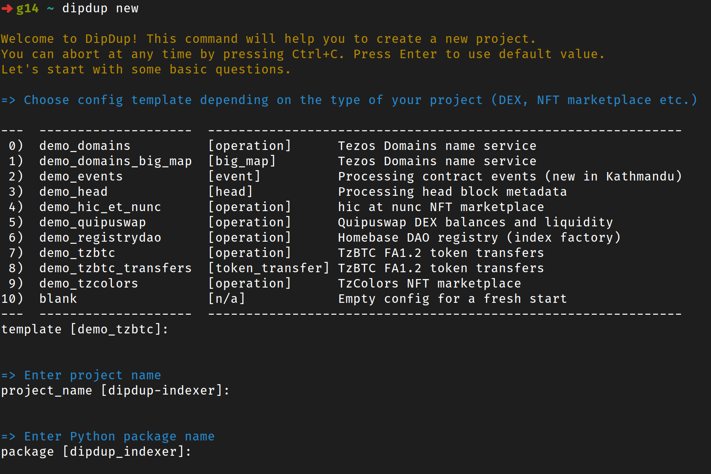

# 6.2.0

## What's New

### New interactive installer

Starting from this release, DipDup comes with an interactive installer to help you install necessary dependencies.

Run the command below in the terminal:

```shell
python -c "$(curl -sSL https://dipdup.io/install.py)"
```

Follow the instructions to complete the installation.

Now you have `dipdup` command available systemwide! Run it without arguments to see available commands.

You can use `dipdup install/update/uninstall` commands to manage the local installation.

### Project scaffolding

`dipdup new` command is now available to create a new project from a template. Run it and follow the questions; a new project will be created in the current directory. You can also use a replay file instead; see `dipdup new --help` for details.

<center></center>

### Kathmandu contract events

Kathmandu Tezos protocol upgrade has introduced [contract events](https://tezos.gitlab.io/alpha/event.html), a new way to interact with smart contracts. This index allows indexing events using strictly typed payloads. From the developer's perspective, it's similar to the `big_map` index with a few differences.

An example below is artificial since no known contracts in mainnet are currently using events.

```yaml
{{ #include ../../demos/demo-events/dipdup.yml:23:32 }}
```

Unlike big maps, contracts may introduce new event tags and payloads at any time, so the index must be updated accordingly.

```python
{{ #include ../../demos/demo-events/src/demo_events/handlers/on_events_xrate.py:7: }}
```

Each contract can have a fallback handler called for all unknown events so you can process untyped data.

```python
{{ #include ../../demos/demo-events/src/demo_events/handlers/on_events_unknown.py:6: }}
```

## Changes since 5.1.3

### Added

- cli: `new` command to create a new project interactively.
- cli: `install/update/uninstall` commands to manage local DipDup installation.
- index: New index kind `event` to process contract events.
- install: New interactive installer based on pipx (`install.py` or `dipdup-install`).

### Fixed

- cli: Fixed commands that don't require a valid config yet crash with `ConfigurationError`.
- codegen: Fail on demand when `datamodel-codegen` is not available.
- codegen: Fixed Jinja2 template caching.
- config: Allow `sentry.dsn` field to be empty.
- config: Fixed greedy environment variable regex.
- hooks: Raise a `FeatureAvailabilityHook` instead of a warning when trying to execute hooks on SQLite.

### Improved

- cli: Detect `src/` layout when guessing package path.
- codegen: Improved cross-platform compatibility.
- config: `sentry.user_id` option to set user ID for Sentry (affects release adoption data).
- sentry: Detect environment when not set in config (docker/gha/tests/local)
- sentry: Expose more tags under the `dipdup` namespace.

### Performance

- cli: Up to 5x faster startup for some commands.

### Security

- sentry: Prevent Sentry from leaking hostname if `server_name` is not set.
- sentry: Notify about using Sentry when DSN is set or crash reporting is enabled.

### Other

- ci: A significantly faster execution of GitHub Actions.
- docs: Updated "Contributing Guide" page.
