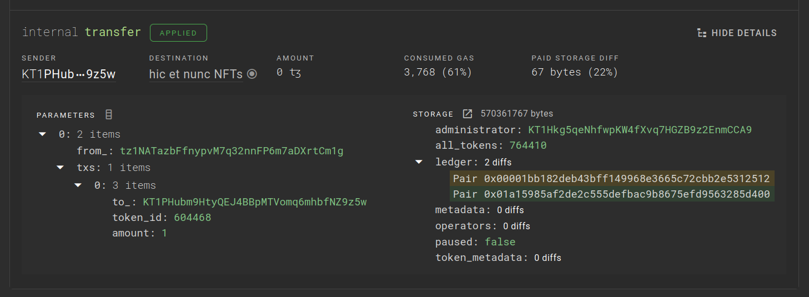

# Troubleshooting

This page contains tips for troubleshooting DipDup issues.

## Update DipDup to the latest version

DipDup framework evolves rapidly just like Tezos itself does. We recommend keeping your project up-to-date with the latest version of DipDup.

If you're using Poetry, set caret version constraint in `pyproject.toml` to use the latest release of the current major version:

```toml
[tool.poetry.dependencies]
python = ">=3.10,<3.11"
dipdup = "^{{ cookiecutter.dipdup_version }}"
```

pipx installations always use latest version.

Run `dipdup update` periodically to update to the latest version.

While building Docker images you can use `X` and `X.Y` tags to lock to specific major/minor releases:

```Dockerfile
FROM dipdup/dipdup:{{ cookiecutter.dipdup_version }}
```

## Ensure that config is correct

DipDup config can be correct syntactically but not necessarily semantically. It's especially easy to make a mistake when actively using templates and environment variables. Use `config export` command to dump config the way DipDup "sees" it, after resolving all links and templates. `config env` command can help you to find missing environment variables.

```shell
dipdup -c dipdup.yml -c dipdup.prod.yml config export
dipdup -c dipdup.yml -c dipdup.prod.yml config env
```

> 💡 **SEE ALSO**
>
> * {{ #summary cli-reference.md#dipdup-config-export }}
> * {{ #summary cli-reference.md#dipdup-config-env }}
> * {{ #summary config/README.md }}

## Enable debug logging and crash reporting

More logs can give you a clue about the reason for an issue. Enable them in config:

```yaml
logging: verbose
```

When an exception occurs DipDup saves crash dumps to `/tmp/dipdup/crashdumps/XXXXXXX.json`. You can send those dumps to Baking Bad automatically:

```yaml
advanced:
  crash_reporting: True
```

## Use linters to find errors in your Python code

Exceptions that occurred during callback execution are reraised as `CallbackError`s. If you experience this issue, most likely your code is incorrect. Luckily, the Python ecosystem has lots of tools called linters to help you find mistakes. In DipDup we mostly use a combo of `flake8` and `mypy`. You can start using both with zero configuration:

```shell
poetry add --with dev flake8 mypy
poetry run flake8
poetry run mypy
```

You can find a more complex example in DipDup's [pyproject.toml](https://raw.githubusercontent.com/dipdup-net/dipdup/master/pyproject.toml) or use the cookiecutter template to create a new project with all recommended bells and whistles (see {{ #summary quickstart.md#from-template }}).

## Explore contract calls in Better Call Dev

[Better Call Dev](https://better-call.dev) is a blockchain explorer for Tezos smart contracts. It provides a more human-friendly interface than TzKT to explore exact contract calls and parameter/storage structures.



Try it out when writing index definitions.

## Packaging issues

Poetry package manager we recommend using with DipDup is not the most stable software in the world. If you experience issues with it like `SolverProblemError`, try the following:

* Remove `.venv` and `poetry.lock` from the project root
* Remove `~/.cache/pypoetry` and `~/.cache/pip/` directories
* Run `poetry install` and hope for the best.

## Got stuck? Ask for help

We are always ready to answer your questions!

If you think you've found a bug, please report it directly to the [GitHub Issues](https://github.com/dipdup-net/dipdup). For all other discussions, join our socials:

* [Discord](https://discord.com/invite/RcPGSdcVSx) (preferred)
* [Telegram](https://t.me/baking_bad_chat)
* [Slack](https://tezos-dev.slack.com/archives/CV5NX7F2L)
